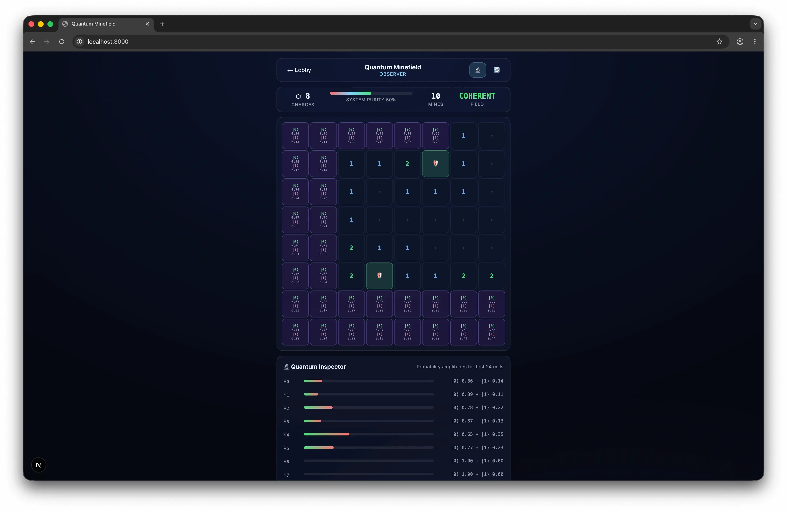

# Quantum Minefield

> A quantum-themed twist on Minesweeper — built with Rust, WebAssembly, and Next.js 16.

Mines exist in **quantum superposition** until observed. Instead of flagging mines, you **purify the wavefunction** by driving system entropy to zero — revealing safe cells and containing mines before detonation.



## Features

- **Wavefunction Purification** — win by resolving every cell, not by flagging. Entropy hits zero = victory.
- **Quantum Containment** — right-click to lock down suspected mines. You get exactly as many charges as there are mines — use them wisely.
- **Difficulty-Scaled Circuits** — quantum gates (Hadamard, Phase Shift) scramble your probability hints. Higher difficulty = less reliable information.
- **Entangled Cells** — some cells are quantum-entangled: observing one shifts the other's probability.
- **Quantum Inspector** — toggle to see raw probability amplitudes (`|0⟩`/`|1⟩` notation) for any unresolved cell.
- **Flood Fill** — clicking a safe cell with zero adjacent mines auto-reveals its neighbors.
- **Deterministic Replays** — every game is seeded; share a seed to replay the exact same board.
- **Glassmorphism UI** — frosted-glass aesthetic with entropy progress bar and containment charge HUD.

## Difficulty Levels

| Level          | Grid  | Mines | Quantum Interference                         |
| -------------- | ----- | ----- | -------------------------------------------- |
| **Observer**   | 8×8   | 10    | Mild — hints stay close to truth             |
| **Researcher** | 12×12 | 24    | Moderate — Hadamard + Phase Shift scrambling |
| **Theorist**   | 16×16 | 50    | Heavy — double Hadamard, unreliable hints    |

## Architecture

```
quantum-minefield/
├── crates/
│   ├── qmf-core/    → Pure Rust game logic (grid, circuits, entanglement, RNG)
│   └── qmf-wasm/    → wasm-bindgen bridge (JS-friendly API)
├── apps/
│   └── web/         → Next.js 16 App Router frontend (Turbopack)
└── scripts/         → wasm-pack build helpers
```

**Design Principles:**

- **Rust owns the state** — React is a stateless renderer. All game logic lives in `qmf-core`.
- **Zero external randomness** — hand-rolled SplitMix64 PRNG, no `rand` crate.
- **Pre-built wasm** — `.wasm` artifacts ship in the repo for zero-Rust deploys on Vercel.

## Quick Start

### Prerequisites

- [Rust](https://rustup.rs) (stable — auto-configured via `rust-toolchain.toml`)
- [wasm-pack](https://rustwasm.github.io/wasm-pack/installer/) (`cargo install wasm-pack`)
- [Node.js](https://nodejs.org) 24+ (see `.nvmrc`)
- [pnpm](https://pnpm.io) 10+ (`corepack enable` or `npm i -g pnpm`)

### Install & Run

```bash
# Install JS dependencies
pnpm install

# Build wasm + start dev server
pnpm dev
```

Open [http://localhost:3000](http://localhost:3000).

> **Tip:** After the initial wasm build, use `pnpm dev:web` for fast frontend-only iteration. Only re-run `pnpm wasm:dev` when you change Rust code.

## Scripts

| Command           | Description                                  |
| ----------------- | -------------------------------------------- |
| `pnpm dev`        | Build wasm (dev) + start Next.js dev server  |
| `pnpm dev:web`    | Start Next.js only (assumes wasm is built)   |
| `pnpm wasm:dev`   | Build wasm in dev mode (fast, debug symbols) |
| `pnpm wasm:build` | Build wasm in release mode (optimized)       |
| `pnpm build`      | Full production build (wasm + Next.js)       |
| `pnpm start`      | Serve production build                       |

## How It Works

### Game Loop

```
User clicks cell (left = reveal, right = contain)
    ↓
useQuantumGame hook calls wasm bridge
    ↓
Rust mutates QuantumGrid:
  • First click → mines placed (Fisher-Yates shuffle, safe zone guaranteed)
  • Reveal → flood fill if zero adjacent mines
  • Contain → lock mine (correct) or waste charge (wrong)
    ↓
Serialized snapshot returned via serde-wasm-bindgen
    ↓
React re-renders board, entropy bar, and charge HUD
    ↓
Entropy = 0 → Victory  |  Mine detonated → Game Over
```

### Quantum Mechanics (Simplified)

| Concept           | In-Game Effect                                                   |
| ----------------- | ---------------------------------------------------------------- |
| **Superposition** | Unobserved cells show a probability of being a mine              |
| **Measurement**   | Clicking collapses the cell — safe (reveal count) or mine (boom) |
| **Entanglement**  | Paired cells: observing one shifts the other's probability       |
| **Circuits**      | Gate chains distort displayed probabilities by difficulty        |

### Rust Core (`qmf-core`)

- **`QuantumGrid`** — game state, mine placement, reveal/contain actions, win condition, flood fill.
- **`Circuit`** — `apply_probability()` folds Hadamard, PhaseShift, and Not gates over a probability.
- **`Entanglement`** — stores pairs and computes correlated probability shifts.
- **`SplitMix64`** — deterministic 64-bit PRNG seeded per game.

### Tests

```bash
cargo test --workspace   # 21 tests across core and wasm crates
```

Covers: grid mechanics, first-click safety, flood fill cascading, containment logic, entropy tracking, win/loss conditions, circuit math, and RNG properties.

## Deployment

### Vercel (Zero-Rust)

The wasm binary is pre-built and committed to `apps/web/public/wasm/`. Vercel only needs Node.js:

| Setting              | Value            |
| -------------------- | ---------------- |
| **Build Command**    | `pnpm build`     |
| **Output Directory** | `apps/web/.next` |

### Self-Hosted

```bash
pnpm wasm:build   # Optimized wasm
pnpm build         # Next.js production build
pnpm start         # Serve on port 3000
```

## Contributing

See [CONTRIBUTING.md](CONTRIBUTING.md) for setup instructions, development workflow, commit conventions, and areas where help is welcome.

## Tech Stack

| Layer           | Technology                           |
| --------------- | ------------------------------------ |
| Game Logic      | Rust 2021 edition                    |
| Wasm Bridge     | wasm-bindgen 0.2, serde-wasm-bindgen |
| Frontend        | Next.js 16, React 19, TypeScript 5.9 |
| Bundler         | Turbopack                            |
| Package Manager | pnpm 10 (workspaces)                 |
| Deployment      | Vercel (zero-Rust)                   |

## License

[MIT](LICENSE)
